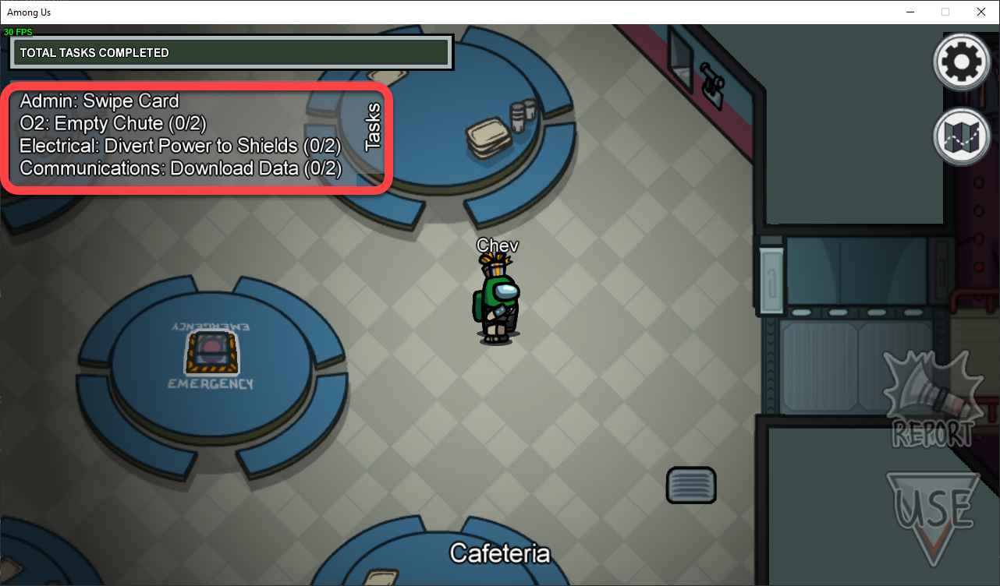
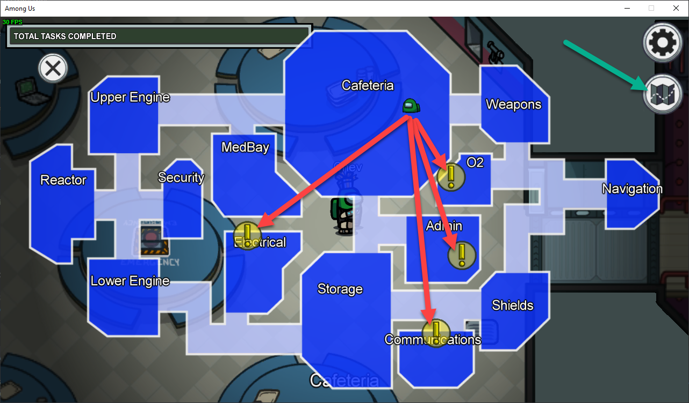
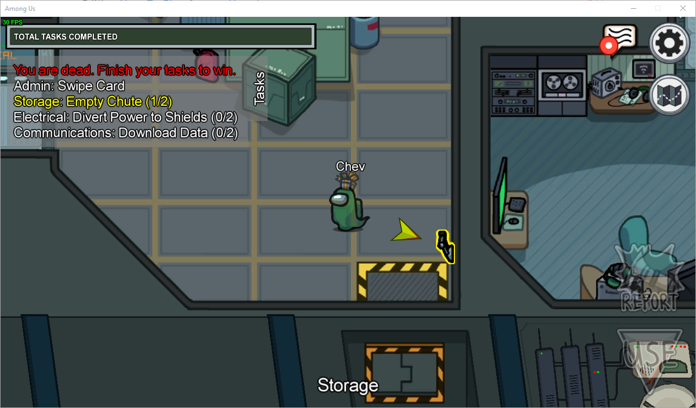
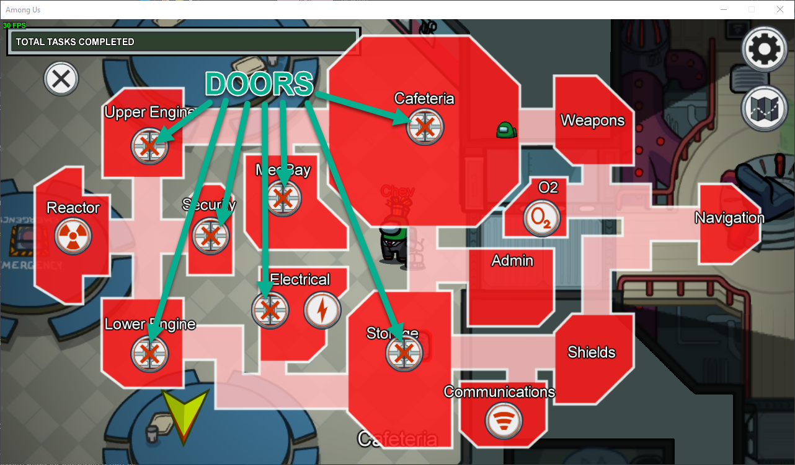
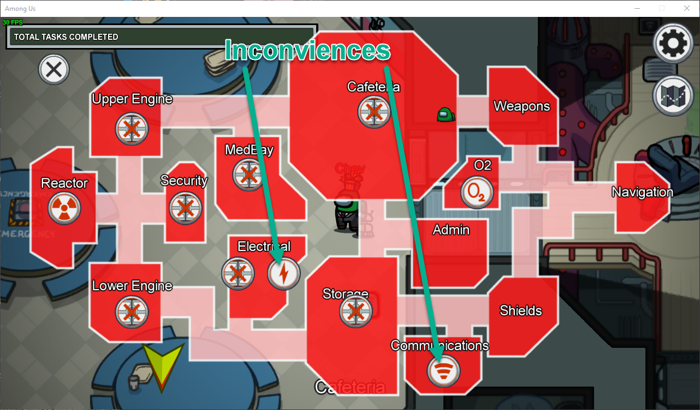
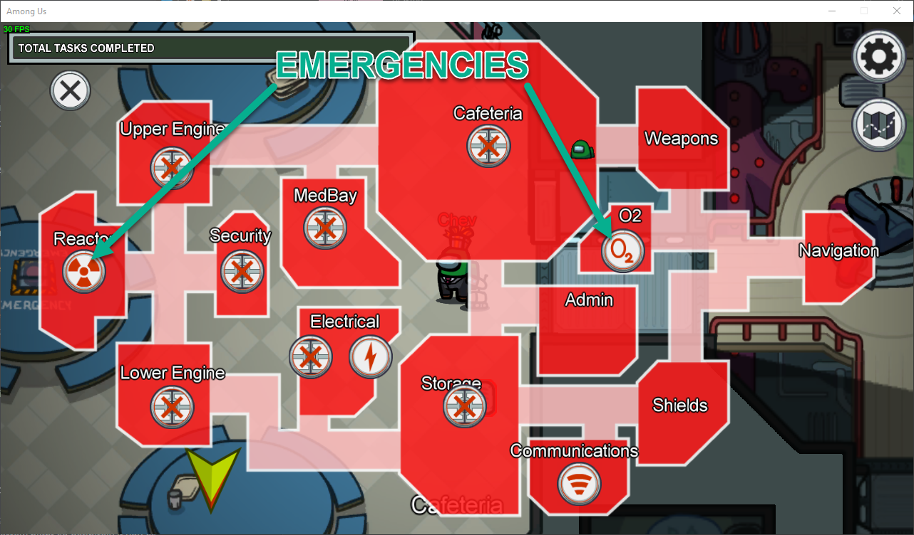

# How To Play Among Us

## Overview

5-10 people on a crew. Game starts and tells you if you are a crewmate or an imposter. Crewmates do tasks and keep their eyes peeled for any funny business. Imposter(s) try to sneakily kill crewmates without being seen. There is no talking (at least about game stuff) while people are doing tasks. Only when a crew meeting has been called can you speak about the game.

> Note: If you have a hard time containing vocal (or visual if using a webcam) reactions then we recommend muting your mic while doing tasks so no gasps or other vocalizations will give away that you have been killed.

There are two ways crew meetings can be called.

1. **The emergency meeting button in the cafeteria.** Everyone has 1 emergency meeting they can call (or more if game host changes it). Only use it if you have concrete evidence to share about someone you suspect. For example, if you saw a player pop out of a ventilation duct then you know they are the imposter because regular crewmates can't use the vents.

2. **A body is reported.** Anyone can report a dead body, including the imposters themselves which is known as "self-reporting". If you find a body and hit the report button then a crew meeting is immediately called and everyone can begin discussing the game and what they do or don't know.

Once a meeting is called then all players have to vote on who they think is the imposter. If you can't decide who is the imposter you can vote to skip down in the bottom left corner of the meeting screen. If a majority vote is cast on a single player then that player is ejected. Crewmates win if they eject all the imposters. Imposter(s) win if they eject or kill most of the crewmates.

---

## Crewmate

If you are a crewmate you will have tasks around the map to complete.

Mostly pretty easy stuff like pushing a button or solving a small puzzle.

While doing tasks you just want to keep your eyes peeled for who is doing what as you pass them. Do try to complete your tasks quickly because if everyone completes them then the crewmates win.

If you die you will turn into a ghost and only other ghosts will be able to see you. It is important to note that **ghosts still have tasks**.

Don't stop doing your tasks just because you got killed. In fact, you can do them faster now because you can move through walls :D

---

## Imposter

If you are an imposter you will have tasks on your map but you won't be able to do them. Best you can do is walk up to them and pretend you are doing them so you don't look suspicious to the crew. However, your real goal is to kill people.

You can sneak around the map using ventilation ducts.

Just don't let people see you use them because only the imposter can use them.

You want to be sneaky and try to get people alone and then kill them so nobody else sees you do it. You can sit inside vents and wait for the exit to be clear before you pop out, making for a convenient way to catch crew members by surprise.

As an imposter you have another useful tool at your disposal. The sabotage map. At any time and from anywhere you can click the sabotage button and pull up a map. There are three types of sabotage you can do.

1. **Doors.** Tons of rooms on the sabotage map have a doors button. If you click it then the doors to that room or section will close and lock for about 30 seconds. You can use this to trap someone in with you or you could simply use it to annoy or cast suspicions on other players.

    

2. **Inconviences.** There are two sabotage hacks you can do that are merely inconveniences for the players. First is the lightning bolt in Electrical. If you click that button it will turn the lights out across the whole ship. Crewmates will only be able to see an inch in front of themselves, but you as the imposter will still have full vision. The second is the wifi symbol in Communications. Clicking that will sabotage comms which takes down cameras and prevents upload tasks from being completed until it is resolved.

    

3. **Emergencies.** There are two things you can sabotage that require immediate attention from the crew or else they risk losing the game. First is the radioactive symbol in Reactor. Clicking that will trigger a reactor core meltdown and all crewmates must attend to this emergency or risk losing the game. If the timer runs out and the sabotage is not resolved then the ship explodes and the imposter wins. The second is the O2 button in the O2 room. Hitting that button will disable life support on the ship. Just like reactor a countdown will begin and if it hits zero before the crew can resolve it then they will all die and the imposter wins.

    

---

That's it! There's a few other little things around the map such as the cameras in Security or the console in Admin that will show you some info about where players are. Feel free to fiddle with those, but **only if your tasks are done!** If you're in security watching the cameras all the time but haven't completed your tasks then your friends might get a bit testy since you are preventing crewmates from being able to win by task completion.

Now go play and get ready for some hilarious moments, like [this one!](https://youtu.be/3QCwInr7yHM)

<iframe style="width: 100%; min-height: 315px;" src="https://www.youtube.com/embed/3QCwInr7yHM" frameborder="0" allow="accelerometer; autoplay; clipboard-write; encrypted-media; gyroscope; picture-in-picture" allowfullscreen></iframe>